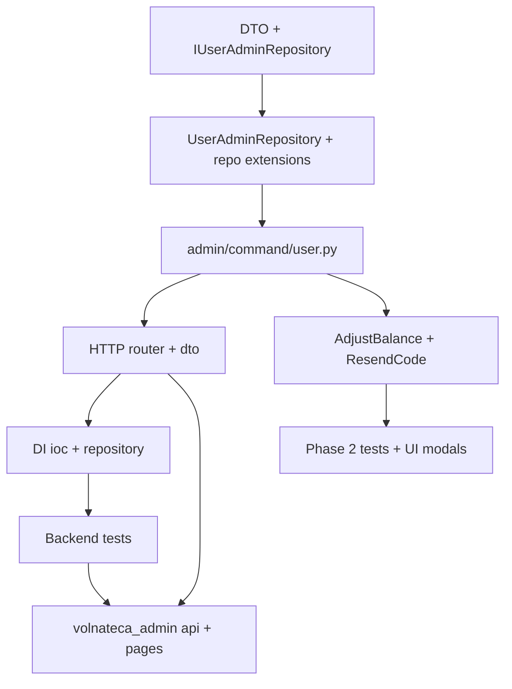

# Пайплайн: раздел «Пользователь» в админке

Документ описывает реализацию **без кода** — только порядок работ, контракты и файлы. Основан на изучении текущего бота (`volnateca_bot`) и SPA (`volnateca_admin`).

## Цель

Снизить нагрузку на разработчиков при жалобах из VK: искать пользователя, смотреть баланс/историю/заявки/рефералы и выполнять ограниченный набор ручных действий **без прямого доступа к БД**.

## Что уже есть (опорные файлы)

### Данные

| Сущность | Модель | Ключевые поля для админки |
|----------|--------|---------------------------|
| Пользователь | `src/infrastructure/database/models/users.py` | `vk_user_id`, `first_name`, `last_name`, `vk_screen_name`, `balance_points`, `earned_points_total`, `spent_points_total`, `current_level`, `is_active` |
| Транзакции | `src/infrastructure/database/models/transactions.py` | журнал; `TransactionSource.ADJUSTMENT` в `src/domain/enums/transaction.py` — задуман для ручных правок, в проде не используется |
| Выполнения заданий | `src/infrastructure/database/models/task_completions.py` | статус, `points_awarded`, `transactions_id`, `completion_key` |
| Заявки на призы | `src/infrastructure/database/models/prize_redemptions.py` | `redemption_code`, статусы, `users_id` |
| Рефералы | `src/infrastructure/database/models/referrals.py` | `inviter_users_id`, `invited_users_id`, `bonus_transactions_id` |

Индексы для поиска уже есть: `users.vk_user_id` (unique), `users.vk_screen_name` — **миграции для фазы 1 не требуются**.

### Репозитории (бот, без admin-слоя)

| Репозиторий | Файл | Что есть / чего нет |
|-------------|------|---------------------|
| `IUserRepository` | `src/application/interface/repositories/users.py` | `get_by_vk_user_id`, `get_balance_snapshot_by_users_id_for_update`, `apply_balance_change` — **нет** `get_by_users_id` (read), **нет** поиска |
| `IPrizeRedemptionRepository` | `src/application/interface/repositories/prize_redemptions.py` | **`list_by_user`** уже реализован в `src/infrastructure/database/repositories/prize_redemptions.py` |
| `ITransactionRepository` | `src/application/interface/repositories/transactions.py` | только `create` и `list_top_accrual_users_for_period` — **нет** списка по пользователю |
| `ITaskCompletionRepository` | `src/application/interface/repositories/task_completions.py` | CRUD для бота — **нет** списка по `users_id` |
| `IReferralRepository` | `src/application/interface/repositories/referrals.py` | `create_if_not_exists`, `count_referrals` — **нет** списков для карточки |

### Admin API (эталон паттерна)

Цепочка на примере заявок на призы:

1. Router: `src/presentation/http/routers/admin/prize_redemptions.py` (`DishkaRoute`, `FromDishka[Handler]`)
2. HTTP DTO: `src/presentation/http/dto/admin/prize_redemption.py` (`to_command()`, `from_dto()`)
3. Handlers: `src/application/admin/command/prize_redemption.py` (`Interactor`, dataclass commands)
4. Admin DTO: `src/application/admin/dto/prize_redemption.py`
5. Репозиторий: общий `IPrizeRedemptionRepository` (не отдельный admin-repo)
6. Регистрация: `src/presentation/http/routers/admin/__init__.py`, провайдеры в `src/di/ioc.py`, `src/di/repository.py`

Отдельный admin-репозиторий используется там, где нет подходящего ботового API — см. `IPrizeAdminRepository` + `src/infrastructure/database/repositories/admin/prize.py`.

### Сервисы для переиспользования

| Сервис | Файл | Использование в user support |
|--------|------|------------------------------|
| `WalletService` | `src/domain/services/wallet.py` | начисление/списание при adjustment |
| `get_level` / `get_level_name` | `src/domain/services/level.py` | отображение уровня; пересчёт после adjustment |
| `CancelRedemptionService` | `src/application/services/cancel_redemption_service.py` | эталон: lock → wallet → transaction → persist |
| `FulfillRedemptionService` | `src/application/services/fulfill_redemption_service.py` | уже в админке |
| `ListUserRedemptionsHandler` | `src/application/command/list_user_redemptions.py` | бот; для админки — обёртка или прямой вызов `list_by_user` с большим page size |
| VK отправка | `src/infrastructure/vk/client.py` (`IVKMessageClient.send_message`) | resend кода |
| Шаблон `store_pickup_success` | `src/application/services/vk_message_template_catalog.py` | текст resend |

### Админка (фронт)

| Файл | Роль |
|------|------|
| `volnateca_admin/src/App.tsx` | маршруты |
| `volnateca_admin/src/layouts/Sidebar/Sidebar.tsx` | навигация |
| `volnateca_admin/src/api/client.ts` | `apiFetch`, auth |
| `volnateca_admin/src/api/prizeRedemptions.ts` | эталон API-модуля |
| `volnateca_admin/src/pages/prizeRedemptions/PrizeRedemptionsPage.tsx` | очередь выдачи; клиентский поиск `utils/prizeRedemption.ts` — **не заменяет** серверный поиск пользователя |
| `volnateca_admin/src/utils/prizeRedemption.ts` | `buildVkUserUrl` — переиспользовать на карточке пользователя |

---

## Объём по фазам

### Фаза 1 — чтение (MVP, закрывает ~80% обращений)

- Поиск пользователя
- Карточка: профиль + баланс/уровень/earned/spent
- Вкладки/секции: заявки на призы, выполнения заданий, рефералы, история транзакций
- Ссылки на существующие действия fulfill/cancel заявки (без дублирования логики)

### Фаза 2 — безопасные ручные действия

- Доначисление / списание ✦ (`TransactionSource.ADJUSTMENT`)
- Повторная отправка кода выдачи в VK (только `reserved`)

### Фаза 3 — высокий риск (отдельный релиз)

- Откат ошибочного выполнения задания
- `PATCH is_active` (бан/деактивация)
- Починка реферального бонуса

---

## Контракт API (черновик)

Префикс: `/v1/admin` (как в `admin_router`). Auth без изменений: `verify_admin_credentials` + `verify_admin_token`.

### Фаза 1

```
GET /users/search?q={string}&limit=20
```

Поведение `q` (нормализация в handler):

| Ввод | Стратегия |
|------|-----------|
| Только цифры, длина ≥ 5 | точное `vk_user_id` **или** `users_id` (если число ≤ max int и есть в БД) |
| Начинается с `VLT` / без пробелов, похоже на код | lookup `prize_redemptions.redemption_code` → один `users_id` в выдаче |
| Иначе | `ILIKE` по `first_name`, `last_name`, `vk_screen_name` (limit, order by `users_id`) |

Ответ: `list[UserSearchHit]` — `users_id`, `vk_user_id`, display name, `balance_points`, `current_level`.

```
GET /users/{users_id}
```

Ответ: `UserProfile` — все поля из `users` + `level_name` из `get_level_name`, `vk_profile_url`, счётчики (опционально: `referrals_count`, `redemptions_reserved_count`).

```
GET /users/{users_id}/prize-redemptions?page=1
GET /users/{users_id}/task-completions?page=1
GET /users/{users_id}/transactions?page=1
GET /users/{users_id}/referrals
```

Пагинация: как у заявок — **50** для redemptions/transactions/completions (константа в admin command, по аналогии с `ADMIN_REDEMPTIONS_PAGE_SIZE` в `prize_redemption.py`).

`referrals` — без пагинации на первом этапе (обычно мало записей):

- `invited_by`: inviter `users_id`, `vk_user_id`, имена, `referrals.created_at`, `bonus_transactions_id`
- `invited_users`: список приглашённых с теми же полями

HTTP-коды: `404` если `users_id` не найден; поиск — `200` + пустой список.

### Фаза 2

```
POST /users/{users_id}/balance-adjustments
Body: { "amount": int, "reason": str }  // amount > 0 начисление; отрицательный — списание (или отдельное поле direction)
```

Правила:

- `reason` обязателен, min length (например 10)
- `WalletService.accrue` / spend path
- `TransactionSource.ADJUSTMENT`, `description` = reason
- `get_level(earned_points_total)` после начисления
- `uow.commit()` в handler

```
POST /prize-redemptions/{prize_redemptions_id}/resend-code
Body: { "note": str | null }  // только audit в логах, опционально
```

Правила:

- статус `reserved`
- загрузить redemption + prize + user
- отправить VK через `IVKMessageClient` + шаблон `store_pickup_success` (те же переменные, что при покупке в `store.py`)
- не менять БД (или только лог)

### Фаза 3 (вне MVP)

```
POST /users/{users_id}/task-completions/{task_completions_id}/revert
PATCH /users/{users_id}  { "is_active": bool }
```

Требует отдельного design doc: влияние на achievements, уровень, повторное выполнение задания.

---

## Пайплайн backend

### Шаг 0. Подготовка

- [x] Согласовать контракты JSON (имена полей) с фронтом
- [x] Зафиксировать лимиты: search `limit≤20`, list page size `50`

### Шаг 1. Admin DTO и интерфейс репозитория

**Создать:**

| Файл | Содержание |
|------|------------|
| `src/application/admin/dto/user.py` | `UserSearchHitDTO`, `UserProfileAdminDTO`, `UserReferralAdminDTO`, `UserTaskCompletionAdminDTO`, `UserTransactionAdminDTO` |
| `src/application/admin/interface/repositories/user.py` | `IUserAdminRepository`: `search`, `get_profile`, `list_referrals_for_user` |

**Почему отдельный admin-repo:** не раздувать `IUserRepository` (бот) админскими `ILIKE` и join'ами; паттерн как у `IPrizeAdminRepository`.

### Шаг 2. Реализация `UserAdminRepository`

**Создать:** `src/infrastructure/database/repositories/admin/user.py`

Методы (SQLAlchemy, по образцу `admin/prize.py`):

- `search(q, limit)` — ветвление по типу запроса; join с `prize_redemptions` для кода
- `get_profile(users_id)` — `select(User)` → DTO + `get_level_name`
- `list_referrals_for_user(users_id)` — два запроса или один с union:
  - inviter для `received_referral` (`invited_users_id = users_id`)
  - invitees для `inviter_users_id = users_id` + join `User` для `vk_user_id`/имён

**Расширить существующие репозитории** (интерфейс + impl):

| Интерфейс | Новый метод | Impl |
|-----------|-------------|------|
| `ITransactionRepository` | `list_by_users_id(users_id, limit, offset)` | `repositories/transactions.py` — select с `order_by created_at desc`, полный DTO (type, source, description, created_at) |
| `ITaskCompletionRepository` | `list_by_users_id(...)` | `repositories/task_completions.py` — join `Task` для `task_name` |

Для заявок **не дублировать** SQL: admin handler вызывает `IPrizeRedemptionRepository.list_by_user` (уже есть строки 73–91 в `prize_redemptions.py`).

**Опционально в `IUserRepository`:** `get_profile_by_users_id` без lock — если не хотите дублировать чтение `User` в admin-repo. Альтернатива: всё чтение профиля только в `UserAdminRepository`.

### Шаг 3. Admin commands (handlers)

**Создать:** `src/application/admin/command/user.py`

| Handler | Зависимости |
|---------|-------------|
| `SearchUsersHandler` | `IUserAdminRepository` |
| `GetUserProfileHandler` | `IUserAdminRepository` |
| `ListUserPrizeRedemptionsAdminHandler` | `IPrizeRedemptionRepository` + маппинг в `PrizeRedemptionAdminDTO` (переиспользовать `_to_admin_dto` из `prize_redemption.py` — вынести в shared helper или дублировать минимально) |
| `ListUserTaskCompletionsAdminHandler` | `ITaskCompletionRepository` |
| `ListUserTransactionsAdminHandler` | `ITransactionRepository` |
| `GetUserReferralsHandler` | `IUserAdminRepository` |

Команды — dataclass, как в `ListPrizeRedemptionsCommand`.

**Фаза 2 — создать:** `src/application/admin/command/user_balance_adjustment.py`

| Handler | Зависимости |
|---------|-------------|
| `AdjustUserBalanceHandler` | `IUserRepository`, `ITransactionRepository`, `WalletService`, `IUnitOfWork` |

Логика по образцу `CancelRedemptionService`: snapshot `get_balance_snapshot_by_users_id_for_update` → wallet → `transactions.create` → `apply_balance_change` / `apply_spend`.

**Фаза 2 — создать:** `src/application/admin/command/resend_redemption_code.py`

| Handler | Зависимости |
|---------|-------------|
| `ResendRedemptionCodeHandler` | `IPrizeRedemptionRepository`, `IUserRepository`, `IVKMessageClient`, шаблоны |

### Шаг 4. HTTP-слой

**Создать:**

| Файл | |
|------|--|
| `src/presentation/http/dto/admin/user.py` | Query/body schemas, `from_dto` |
| `src/presentation/http/routers/admin/users.py` | эндпоинты фазы 1–2 |

**Изменить:** `src/presentation/http/routers/admin/__init__.py` — `include_router(users_admin_router)`.

Для resend: либо метод в `users.py`, либо добавить в `prize_redemptions.py` (логически ближе к заявке) — **рекомендация:** `prize_redemptions.py`, чтобы фронт вызывал тот же модуль, что и fulfill/cancel.

### Шаг 5. DI

**Изменить:**

| Файл | Действие |
|------|----------|
| `src/di/repository.py` | `provide IUserAdminRepository` → `UserAdminRepository` |
| `src/di/ioc.py` | `@provide` для всех новых handlers (как `get_list_prize_redemptions_handler`) |

`ListUserRedemptionsHandler` из бота в DI уже есть — для админки можно не использовать, если admin handler зовёт репозиторий напрямую (проще pagination 50 vs 10).

### Шаг 6. Тесты

**Создать (pytest):**

| Файл | Что проверять |
|------|----------------|
| `tests/test_admin_user_search.py` | vk id, screen name, redemption code |
| `tests/test_admin_user_profile.py` | 404, поля профиля |
| `tests/test_admin_user_balance_adjustment.py` | accrual, transaction row, level update |
| `tests/test_admin_resend_redemption_code.py` | mock VK client, invalid status → 409 |

Использовать существующие фикстуры БД/сессии из других admin-тестов, если есть; иначе — по паттерну `tests/test_prize_status_sync.py`.

---

## Пайплайн frontend (`volnateca_admin`)

### Шаг 1. Типы и API

**Создать:**

| Файл | |
|------|--|
| `src/types/user.ts` | интерфейсы под контракт API |
| `src/api/users.ts` | `searchUsers`, `getUserProfile`, `listUserRedemptions`, … |

Паттерн: как `src/api/prizeRedemptions.ts` + `apiFetch`.

### Шаг 2. Маршруты и навигация

**Изменить:**

| Файл | Действие |
|------|----------|
| `src/App.tsx` | `/users` (поиск), `/users/:usersId` (карточка) |
| `src/layouts/Sidebar/Sidebar.tsx` | пункт «Пользователь» (вверху списка — частый сценарий) |

### Шаг 3. Страницы

**Создать:**

| Файл | UI |
|------|-----|
| `src/pages/users/UserSearchPage.tsx` | поле поиска, debounce, таблица результатов, клик → карточка |
| `src/pages/users/UserProfilePage.tsx` | hero: имя, ссылка VK (`buildVkUserUrl`), баланс/уровень/earned/spent; табы |
| `src/pages/users/UserProfilePage.module.css` | стили в духе `PrizeRedemptionsPage` |

**Компоненты табов:**

- **Заявки** — таблица; кнопки «Выдать»/«Отменить» через существующие `fulfillPrizeRedemption` / `cancelPrizeRedemption` из `api/prizeRedemptions.ts`
- **Задания** — статус, task name, points, дата
- **Транзакции** — type, source, amount, balance_after, description
- **Рефералы** — блок «Пригласил» / «Кого пригласил»

**Изменить (опционально, фаза 1.5):**

| Файл | Действие |
|------|----------|
| `src/pages/prizeRedemptions/PrizeRedemptionsPage.tsx` | ссылка `vk_user_id` → `/users/:usersId` вместо только внешнего VK |

### Шаг 4. Ручные действия (фаза 2 UI)

На `UserProfilePage`:

- модал «Доначислить ✦»: amount + reason, confirm
- на строке заявки `reserved`: «Отправить код снова»

### Шаг 5. Проверка вручную

- [ ] Поиск по vk id из жалобы
- [ ] Поиск по коду `VLT-…`
- [ ] Карточка совпадает с данными в боте («Мои призы», баланс)
- [ ] Fulfill/cancel с карточки обновляет список
- [ ] Adjustment виден в истории транзакций

---

## Зависимости между шагами



Рекомендуемый порядок разработки: **backend фаза 1 полностью** → фронт карточка → **фаза 2 backend** → фронт modals → фаза 3 отдельным тикетом.

---

## Риски и ограничения

| Риск | Митигация |
|------|-----------|
| Поиск по имени даёт много совпадений | limit 20, показ `vk_user_id`; уточнение запроса |
| Доначисление без audit | обязательный `reason`, `ADJUSTMENT` в transactions |
| Resend спамит VK | rate limit на endpoint (опционально), только `reserved` |
| Откат задания ломает уровень/ачивки | только фаза 3, отдельный сервис |
| `ListUserRedemptionsHandler` page size 10 | админка использует свой handler с 50 |

---

## Критерии приёмки

### Фаза 1

- [x] Оператор находит пользователя по `vk_user_id` без SQL
- [x] Видны balance, level, earned, spent, дата регистрации, `is_active`
- [x] Списки: заявки, задания, транзакции, рефералы
- [x] Из карточки можно выдать/отменить заявку (существующие API)

### Фаза 2

- [ ] Доначисление отражается в балансе и в transactions с `adjustment`
- [ ] Resend доставляет код в VK для активной заявки `reserved`

---

## Вне скоупа (не делать в этом пайплайне)

- Публичный REST для игроков
- Массовый экспорт пользователей
- Редактирование заданий/призов с карточки пользователя
- Автоматическая починка рефералов без бонуса
- Изменение схемы БД (кроме будущих индексов, если поиск по имени окажется медленным)

---

## Чеклист файлов (сводка)

### Backend — новые

- `src/application/admin/dto/user.py`
- `src/application/admin/interface/repositories/user.py`
- `src/infrastructure/database/repositories/admin/user.py`
- `src/application/admin/command/user.py`
- `src/application/admin/command/user_balance_adjustment.py` (фаза 2)
- `src/application/admin/command/resend_redemption_code.py` (фаза 2)
- `src/presentation/http/dto/admin/user.py`
- `src/presentation/http/routers/admin/users.py`
- `tests/test_admin_user_*.py`

### Backend — изменить

- `src/presentation/http/routers/admin/__init__.py`
- `src/presentation/http/routers/admin/prize_redemptions.py` (resend, фаза 2)
- `src/application/interface/repositories/transactions.py`
- `src/infrastructure/database/repositories/transactions.py`
- `src/application/interface/repositories/task_completions.py`
- `src/infrastructure/database/repositories/task_completions.py`
- `src/di/repository.py`
- `src/di/ioc.py`

### Frontend — новые

- `volnateca_admin/src/types/user.ts`
- `volnateca_admin/src/api/users.ts`
- `volnateca_admin/src/pages/users/UserSearchPage.tsx`
- `volnateca_admin/src/pages/users/UserProfilePage.tsx`
- `volnateca_admin/src/pages/users/UserProfilePage.module.css`

### Frontend — изменить

- `volnateca_admin/src/App.tsx`
- `volnateca_admin/src/layouts/Sidebar/Sidebar.tsx`
- `volnateca_admin/src/pages/prizeRedemptions/PrizeRedemptionsPage.tsx` (опционально)

---

## Связь с текущей «Выдачей призов»

Страница `PrizeRedemptionsPage` остаётся **операционной очередью** (FIFO, counter mode). Раздел «Пользователь» — **расследование по человеку**. Пересечение: те же `PrizeRedemptionAdminDTO` и fulfill/cancel; дублировать бизнес-логику не нужно.

После внедрения фазы 1 клиентский `matchesRedemptionSearch` по 50 строкам можно оставить как быстрый фильтр в очереди, но не полагаться на него для поиска пользователя.
